**РОССИЙСКИЙ УНИВЕРСИТЕТ ДРУЖБЫ НАРОДОВ** 

**Факультет физико-математических и естественных наук Кафедра прикладной информатики и теории вероятностей** 

**ОТЧЕТ**  

**ПО ЛАБОРАТОРНОЙ РАБОТЕ № 2** 

*дисциплина:  Архитектура компьютера *

Студент: Лаптев Тимофей Сергеевич 

Группа: НКАбд-01-24         

**МОСКВА** 

**2024**  г.

**Цель работы** 

Изучить  идеологию  и  применение  средств  контроля  версий,  а  также приобрести практические навыки по работе с системой git. 

**1. Выполнение лабораторной работы** 

1. **Настройка GitHub** 

1\. Создаю учетную запись на сайте GitHub. Далее я заполнил основные 

данные учетной записи. 

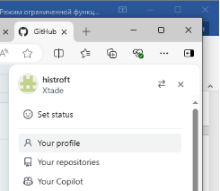

Рис.1: создан аккаунт Github 

2. **Базовая настройка Git** 
1. Отрыл  терминал  и  сделал  предварительную  конфигурацию  git.  Ввел команду git config –global user.name “”, указал имя и команду git config – global user.email “work@mail”, указал в ней электронную почту. 

   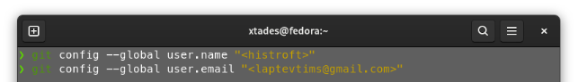

   Рис.2  

2. Настраиваю utf-8 в выводе сообщений git для корректного отображения символов 

Рис.3 

3. Задаю имя «master» для начальной ветки 

   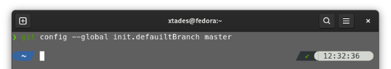

   Рис.4 

4. Задаю  параметр  autocrlf  со  значением  input,  так  как  я  работаю  в системе  Linux,  чтобы  конвертировать  CRLF  в  LF  только  при коммитах. CR и LF –это символы, которые можно использовать для обозначения разрыва строки в текстовых файлах. А также параметр safecrlf со значением warn, так Git будет проверять преобразование на обратимость. При значении warn Git только выведет предупреждение, но будет принимать необратимые конвертации. 

   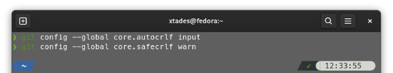

   Рис.5 

3. **Создание SSH-ключа** 
1. Для последующей идентификации пользователя на сервере репозиториев необходимо  сгенерировать  пару  ключей  (приватный  и  открытый).  Для этого  ввожу  команду  ssh-keygen  -C  “Имя  Фамилия,  work@email”, указывая  имя  владельца  и  электронную  почту  владельца.  Ключ автоматически сохранится в каталоге ~/.ssh/. 

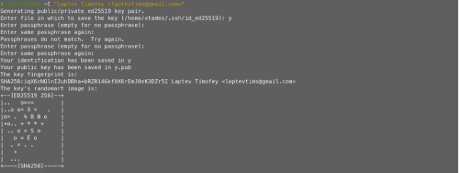

Рис.6 

2. Копирую открытый ключ из директории, в которой он был сохранен, с помощью утилиты xclip 

   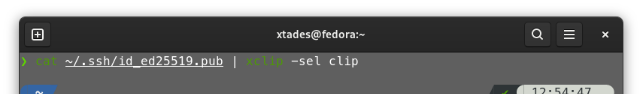

   Рис.7 

3. Открываю  браузер,  захожу  на  сайт  GitHub.  Открываю  свой  профиль  и выбираю страницу  «SSH  and  GPG  keys». Нажимаю кнопку  «New  SSH key» 

   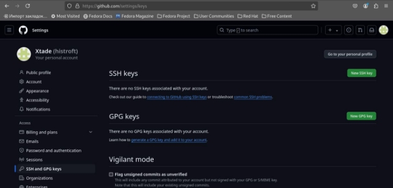

   Рис.8 

4. Вставляю  скопированный  ключ  в  поле  «Key».  В  поле  Title указываю  имя  для  ключа.  Нажимаю  «Add  SSH-key»,  чтобы  завершить добавление ключа 

   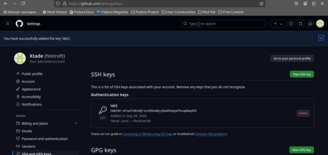

   Рис.9 

4. **Создание рабочего пространства и репозитория курса на основе шаблона** 

1\.  Создаю  директорию,  рабочее  пространство,  с  помощью  утилиты  mkdir, блягодаря ключу -p создаю все директории после домашней ~/work/study/2022- 2023/“Архитектура  компьютера”  рекурсивно.  Далее  проверяю  с  помощью  ls, действительно ли были созданы необходимые мне каталоги 

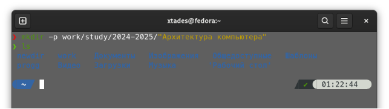

Рис.10 

**3). Создание репозитория курса на основе шаблона** 

1. В браузере перехожу на страницу репозитория с шаблоном курса по адресу  https://github.com/yamadharma/course-directory-student- template.Далее  выбираю  «Use  this  template»,  чтобы  использовать  этот шаблон для своего репозитория 

   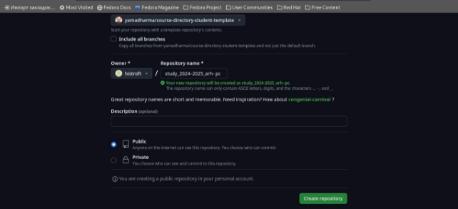

   Рис.11 

2. Через  терминал  перехожу  в  созданный  каталог  курса  с  помощью утилиты cd 

   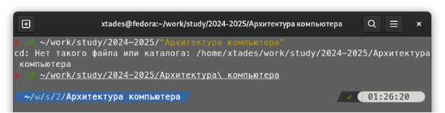

   Рис.12 

3. Клонирую созданный репозиторий с помощью команды git clone – recursive и ссылка, которую я копирую ссылку для клонирования на странице созданного репозитория, сначала перейдя в окно «code»,далее выбрав в окне вкладку «SSH» 

   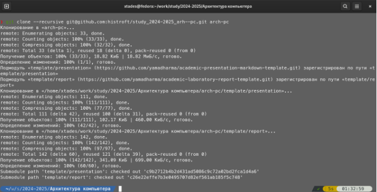

   Рис.13 

5. **Настройка каталога курса** 
1. Удаляю лишние файлы с помощью утилиты rm 

   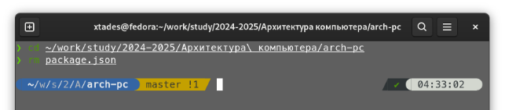

   Рис. 14 

2. Создаю необходимые каталоги 

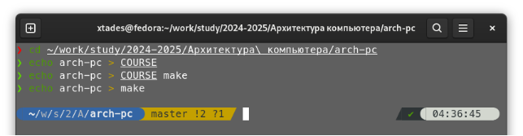

Рис. 15 

3. Отправляю  созданные  каталоги  с  локального  репозитория  на  сервер: добавляю все  созданные  каталоги  с  помощью  git  add, комментирую  и сохраняю  изменения  на  сервере  как  добавление  курса  с  помощью  git commit 

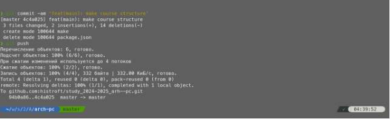

Рис. 16 

4. Понял,  что  совершил  ошибку  в  пункте  2  и  у  меня  не  создались директории,  далее  боролся  с  проблемой,  установил  пакет  “make”,  но директории  все  еще  не  создавались  попытался  найти  решение  в интернете, но ничего не нашел 

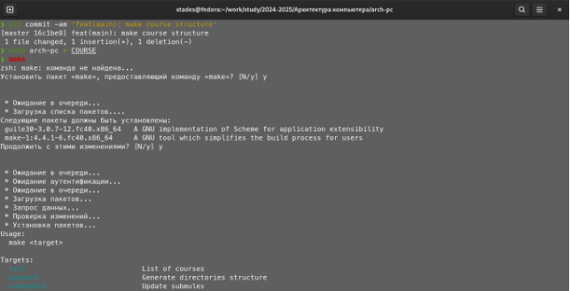

Рис. 17 

5. Внезапно понял, что функция make работает с файлом “makefile” и после этого повторил шаг 2, но уже находясь в нужной директории при помощи команды  cd,  в  директории  arch-pc  произошли  изменения,  теперь, повторяя шаг 3 получен результат 

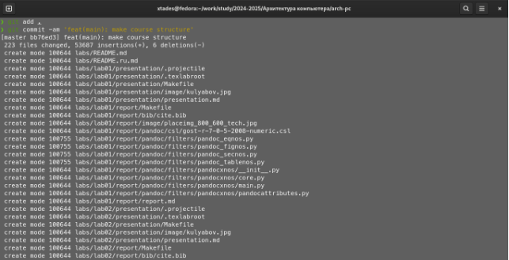

Рис. 18** 

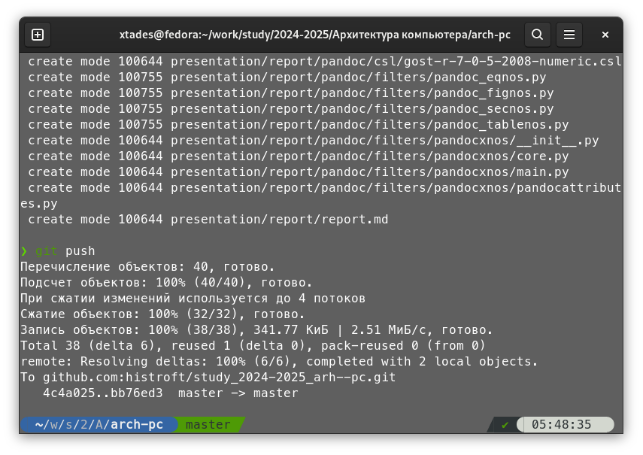

Рис. 19 

6. Осталось  лишь  проверить  правильность  выполнения  работы  на  сайте GitHub 

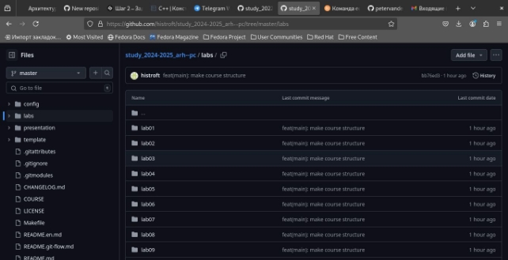

Рис. 20 

6. **Задание для самостоятельной работы.** 

1\. Переношу первую лабораторную работу в нужную директорию 

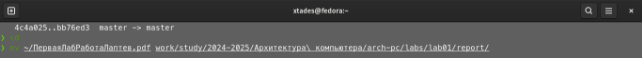

Рис. 21 

(повторил то же действие и со второй лабораторной работой, а также перенес их на платформу GitHub по аналогии с 3 и 5 пунктами настройки каталога курса) 

7. **Вывод** 

При выполнении данной лабораторной работы я приобрел практические навыки работы с Git, GitHub, а также изучил идеалогию и применение средств контроля  версий,  научился  решать  непредвиденные  проблемы  при  работе  с ресурсами. 

8. **Ответы на вопросы** 
- Системы контроля версий (VCS) — это инструменты, позволяющие отслеживать изменения в файлах  и  управлять  их  версиями.  Они  предназначены  для  решения  задач,  связанных  с совместной  работой  над  проектами,  восстановлением  предыдущих  версий  и  упрощением управления изменениями.
- Хранилище: место, где сохраняются все версии проекта. 

  Commit:   действие, которое фиксирует изменения в хранилище, создавая новую версию.  История: последовательность всех коммитов, отражающая изменения проекта.  

  Рабочая копия: локальная версия проекта, с которой работает разработчик. 

- Централизованные  VCS  имеют  центральное  хранилище,  к  которому  подключаются пользователи  (например,  Subversion).  Децентрализованные  VCS  позволяют  каждому пользователю иметь полную копию репозитория (например, Git).
- При единоличной работе с хранилищем пользователь выполняет  коммиты, создает ветки и управляет историей изменений, работая только с локальной копией.
- При  работе  с  общим  хранилищем  пользователи  синхронизируют  свои  изменения  с центральным  репозиторием,  используя  такие  команды,  как  pull  и  push  для  получения  или отправки изменений.
- Основные задачи Git: отслеживание изменений, управление версиями, слияние изменений из разных веток, восстановление предыдущих состояний.
- git init создание основного дерева репозитория git pull получение обновлений (изменений) текущего 

  дерева из центрального репозитория git push отправка всех произведённых изменений локального дерева  в  центральный  репозиторий  git  status  просмотр  списка  изменённых  файлов  в  текущей директории  git  diff  просмотр  текущих  изменения  git  add  .  добавить  все  изменённые  и/или созданные файлы  и/или каталоги git add  имена\_файлов добавить конкретные изменённые  и/или созданные  файлы  и/или  каталоги git rm  имена\_файлов  удалить  файл  и/или  каталог  из  индекса репозитория (при  этом  файл  и/или  каталог  остаётся  в  локальной  директории)  git commit -am 'Описание коммита' сохранить все добавленные изменения и все изменённые файлы git checkout -b имя\_ветки создание новой ветки, базирующейся на текущей git checkout имя\_ветки переключение на некоторую ветку (при переключении на ветку, которой ещё нет в локальном репозитории, она будет создана и связана с удалённой) git push origin имя\_ветки отправка изменений конкретной ветки в центральный репозиторий git merge --no-ff имя\_ветки слияние ветки с текущим деревом git branch -d имя\_ветки удаление локальной уже слитой с основным деревом ветки git branch -D имя\_ветки принудительное удаление локальной ветки git push origin :имя\_ветки удаление ветки с центрального репозитория

- Локальный  репозиторий:  1.  Создание  нового  репозитория:  git  init  2.  Добавление  файлов  в индекс: git add . 3. Сохранение изменений: git commit -m "Первый коммит"

  Удалённый  репозиторий:  1.  Клонирование  удалённого  репозитория:  git  clone  и  ссылка  на репозиторий на ресурсе  GitHub 2. Отправка изменений в  удалённый репозиторий:  git push origin main 3. Получение изменений из удалённого репозитория: git pull origin main
14 
