---
## Front matter
title: "Лабораторная работа №6"
subtitle: "Дисциплина: Архитектура компьютеров"
author: "Лаптев Тимофей Сергеевич"

## Generic otions
lang: ru-RU
toc-title: "Содержание"

## Bibliography
bibliography: bib/cite.bib
csl: pandoc/csl/gost-r-7-0-5-2008-numeric.csl

## Pdf output format
toc: true # Table of contents
toc-depth: 2
lof: true # List of figures
lot: true # List of tables
fontsize: 12pt
linestretch: 1.5
papersize: a4
documentclass: scrreprt
## I18n polyglossia
polyglossia-lang:
  name: russian
  options:
	- spelling=modern
	- babelshorthands=true
polyglossia-otherlangs:
  name: english
## I18n babel
babel-lang: russian
babel-otherlangs: english
## Fonts
mainfont: IBM Plex Serif
romanfont: IBM Plex Serif
sansfont: IBM Plex Sans
monofont: IBM Plex Mono
mathfont: STIX Two Math
mainfontoptions: Ligatures=Common,Ligatures=TeX,Scale=0.94
romanfontoptions: Ligatures=Common,Ligatures=TeX,Scale=0.94
sansfontoptions: Ligatures=Common,Ligatures=TeX,Scale=MatchLowercase,Scale=0.94
monofontoptions: Scale=MatchLowercase,Scale=0.94,FakeStretch=0.9
mathfontoptions:
## Biblatex
biblatex: true
biblio-style: "gost-numeric"
biblatexoptions:
  - parentracker=true
  - backend=biber
  - hyperref=auto
  - language=auto
  - autolang=other*
  - citestyle=gost-numeric
## Pandoc-crossref LaTeX customization
figureTitle: "Рис."
tableTitle: "Таблица"
listingTitle: "Листинг"
lofTitle: "Список иллюстраций"
lotTitle: "Список таблиц"
lolTitle: "Листинги"
## Misc options
indent: true
header-includes:
  - \usepackage{indentfirst}
  - \usepackage{float} # keep figures where there are in the text
  - \floatplacement{figure}{H} # keep figures where there are in the text
---

# Цель работы

Целью данной лабораторной работы является освоение арифметических инструкций языка ассемблера NASM.

# Задание

1. Символьные и численные данные в NASM.
2. Выполнение арифметических операций в NASM.
3. Задание для самостоятельной работы.

# Теоретическое введение

Большинство инструкций на языке ассемблера требуют обработки операндов. Адрес операнда предоставляет место, где хранятся данные, подлежащие обработке. Это могут быть данные хранящиеся в регистре или в ячейке памяти. Далее рассмотрены все существующие способы задания адреса хранения операндов – способы адресации. Существует три основных способа адресации:
• регистровая адресация;
• непосредственная адресация;
• адресация памяти.
Схема команды целочисленного сложения add (от англ. addition - добавление) выполняет сложение двух операндов и записывает результат по адресу первого операнда. Команда add работает как с числами со знаком, так и без знака.
Допустимые сочетания операндов для команды add аналогичны сочетаниям операндов для команды mov. Так, например, команда add eax,ebx прибавит значение из регистра eax к значению из регистра ebx и запишет результат в регистр eax.Команда целочисленного вычитания sub (от англ. subtraction – вычитание) работает аналогично команде add.
Довольно часто при написании программ встречается операция прибавления или вычитания единицы. Прибавление единицы называется инкрементом, а вычитание — декрементом. Для этих операций существуют специальные команды: inc (от англ. increment) и dec (от англ. decrement), которые увеличивают и уменьшают на 1 свой операнд.
Операндом может быть регистр или ячейка памяти любого размера. Команды инкремента и декремента выгодны тем, что они занимают меньше места, чем соответствующие команды сложения и вычитания.
Умножение и деление, в отличии от сложения и вычитания, для знаковых и беззнаковых чисел производиться по-разному, поэтому существуют различные команды. Для беззнакового умножения используется команда mul, для знакового умножения используется команда imul.
Ввод информации с клавиатуры и вывод её на экран осуществляется в символьном виде. Кодирование этой информации производится согласно кодовой таблице символов ASCII. ASCII – сокращение от American Standard Code for Information Interchange (Американский стандартный код для обмена информацией). Согласно стандарту ASCII каждый символ кодируется одним байтом.
Для выполнения лабораторных работ в файле in_out.asm реализованы подпрограммы для преобразования ASCII символов в числа и обратно. Это:
• iprint – вывод на экран чисел в формате ASCII, перед вызовом iprint в регистр eax необходимо записать выводимое число (mov eax,<int>).
• iprintLF – работает аналогично iprint, но при выводе на экран после числа добавляет к символ перевода строки.
• atoi – функция преобразует ascii-код символа в целое число и записает результат в регистр eax, перед вызовом atoi в регистр eax необходимо записать число (mov eax,<int>).

# Выполнение лабораторной работы
## Символьные и численные данные в NASM

Сначала создаю каталог для программ лабораторной работы № 6, перехожу в него и создаю файл lab6-1.asm (рис. [-@fig:001]).

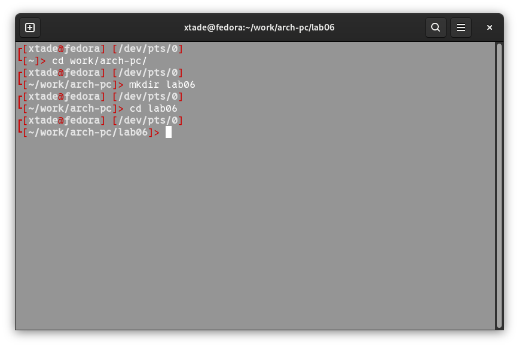{#fig:001 width=70%}

Ввожу в файл lab6-1.asm текст программы из листинга, далее создаю исполняемый файл и запускаю его (рис. [-@fig:002]).

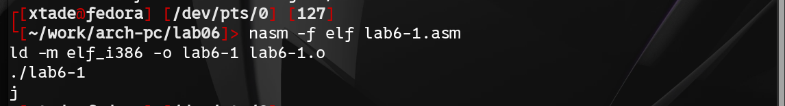{#fig:002 width=70%}

Затем изменяю текст программы и вместо символов, записываю в регистры числа: '6', '4' заменяю на 4, 6.
Создаю исполняемый файл и запускаю его (рис. [-@fig:003]). Это символ перевода строки, он не отображается при выводе на экран.

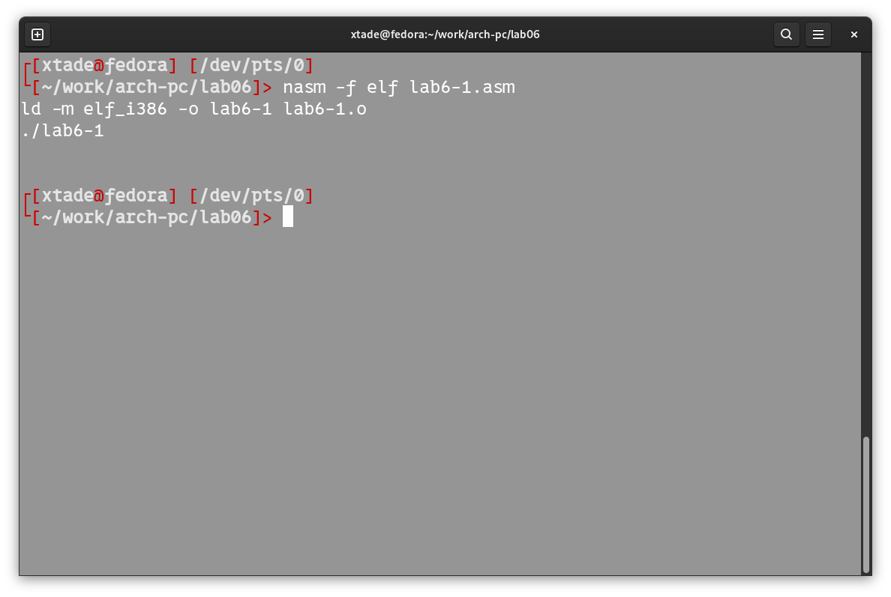{#fig:003 width=70%}

Далее создаю файл lab6-2.asm в каталоге ~/work/arch-pc/lab06 и ввожу в него текст программы из листинга. Создаю исполняемый файл и запускаю его (рис. [-@fig:004]).

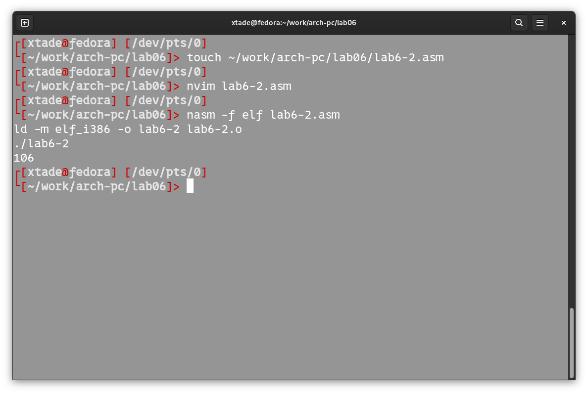{#fig:004 width=70%}

Аналогично предыдущему примеру изменяю символы на числа. Создаю исполняемый файл и запускаю его (рис. [-@fig:005]). Программа складывает числа 6 и 4, поэтому вывод 10.

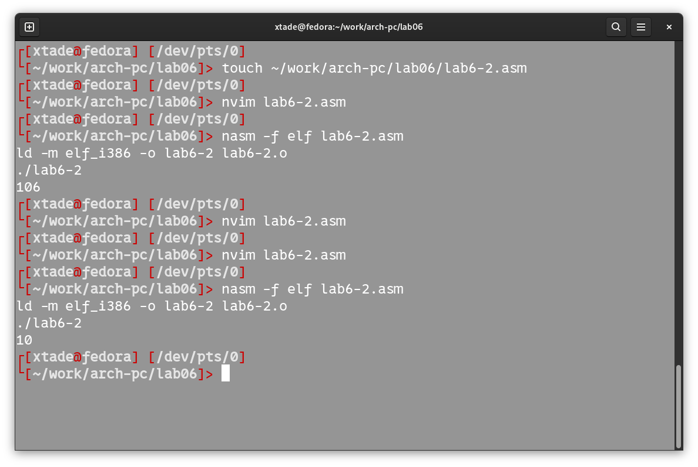{#fig:005 width=70%}

Заменяю функцию iprintLF на iprint, создаю исполняемый файл и запускаю его (рис. [-@fig:006]). Вывод функций отличается тем, что iprint не добавляет в выводе символ переноса строки.

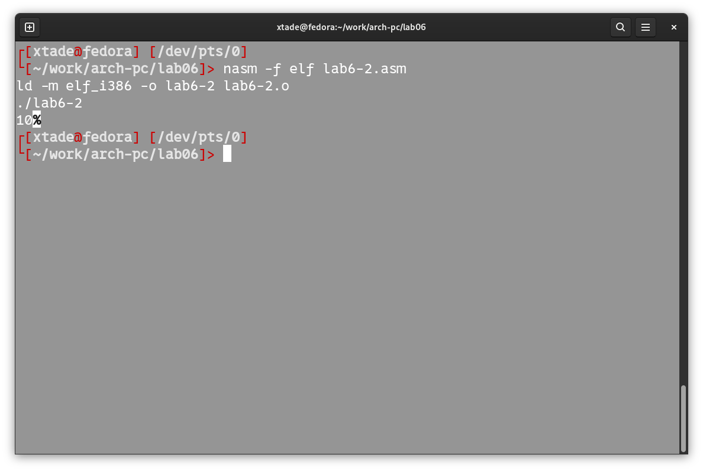{#fig:006 width=70%}

Затем создаю файл lab6-3.asm в каталоге ~/work/arch-pc/lab06. Ввожу текст программы из листинга 6.3 в lab6-3.asmю Создаю исполняемый файл и запускаю его (рис. [-@fig:008]).

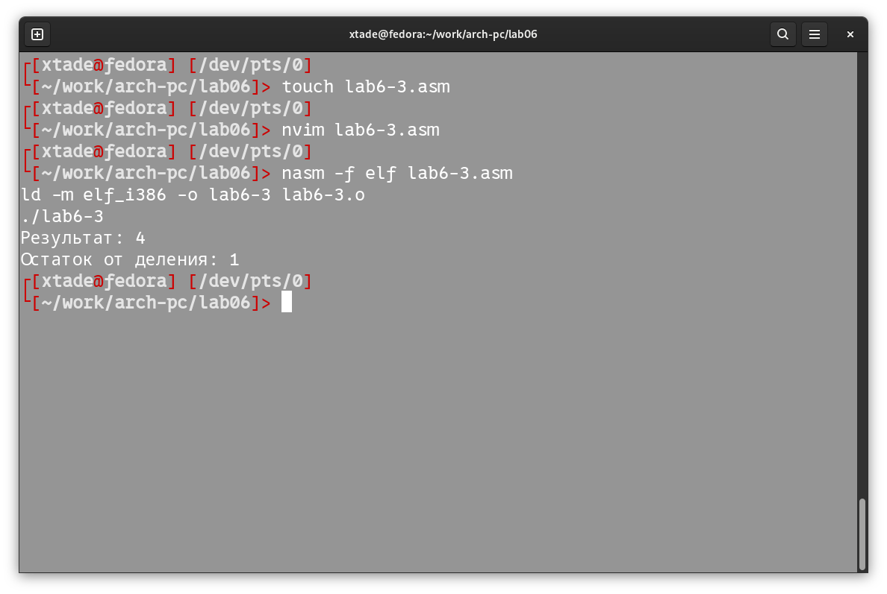{#fig:008 width=70%}

Изменяю текст программы для вычисления выражения f(x) = (4 * 6 + 2)/5. Создаю исполняемый файл и проверяю его работу (рис. [-@fig:009]).

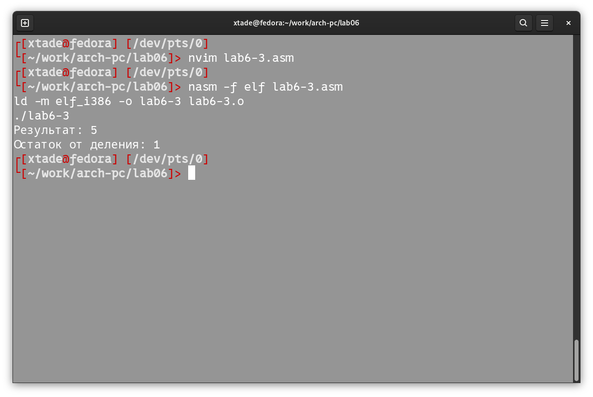{#fig:009 width=70%}

Далее делаю программу вычисления варианта задания для самостоятельной работы по номеру студенческого билета. Создаю файл variant.asm в каталоге ~/work/arch-pc/lab06. Ввожу текст программы из листинга 6.4 в файл variant.asm. Создаю исполняемый файл и запускаю его (рис. [-@fig:010]).

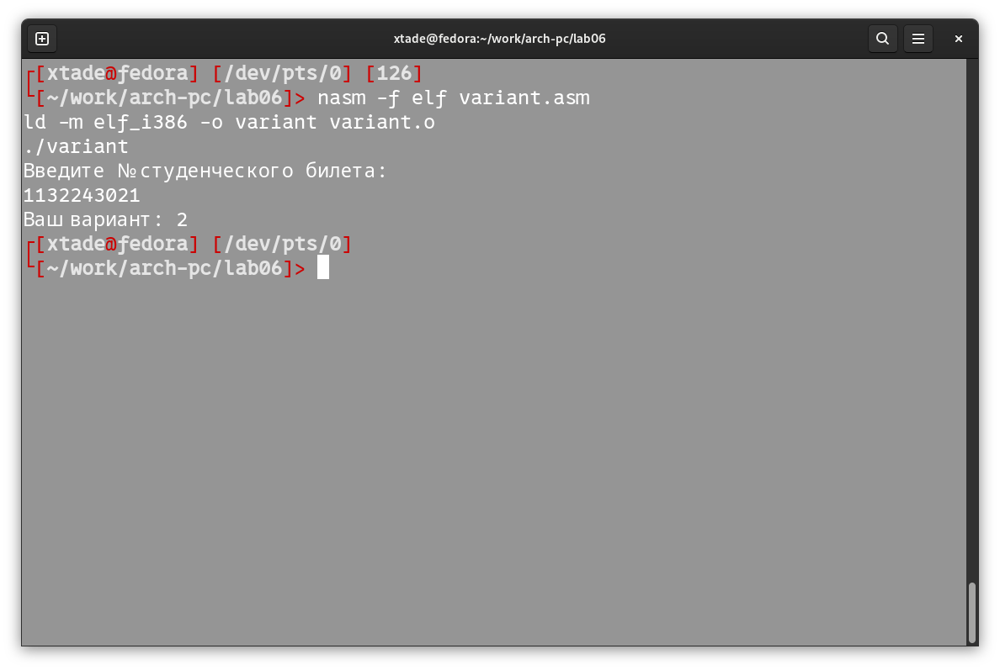{#fig:011 width=70%}

## Ответы на вопросы:

1. За вывод на экран сообщения ‘Ваш вариант:' отвечают следующие строки:
	mov eax,rem
	call sprint 
2. mov ecx, x используется, чтобы положить адрес вводимой строки в регистр, mov edx, 80 используется для записи в регистр длины вводимой строки, call sread вызывает подпрограмму из внешнего файла, чтобы вводить сообщения с клавиатуры.
3. Используется для вызова подпрограммы из внешнего файла, которая преобразует ascii-код символа в целое число и записывает результат в регистр.
4. За вычисление варианта отвечают следующие строки: 
	xor edx,edx
	mov ebx,20
	div ebx
	inc edx
5. В регистр edx.
6. inc edx используется для увеличения значения регистра edx на 1.
7. За вывод на экран результатов вычислений отвечают следующие строки:
	mov eax,edx
	call iprintLF

## Задание для самостоятельной работы

Сначала создаю файл laptevvariant2.asm. (рис. [-@fig:011]) Далее ввожу в файл текст программы для вычисления значения выражения (8x + 6)*10 (вариант 2) (рис. [-@fig:012]).

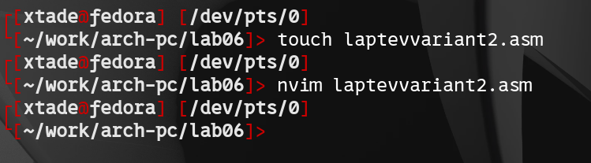{#fig:011 width=70%}
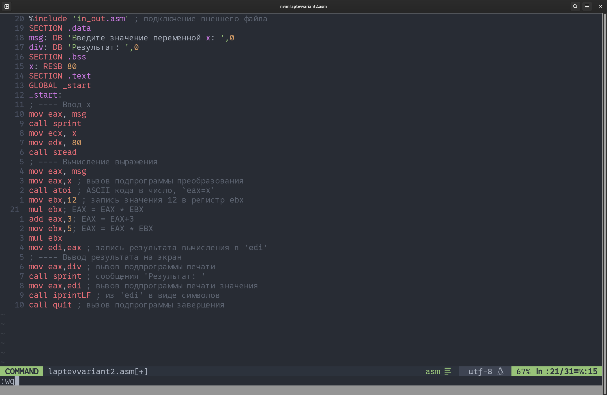{#fig:012 width=70%}

Создаю и запускаю исполняемый файл. Проверил несколько значений, программа работает исправно (рис. [-@fig:013]).

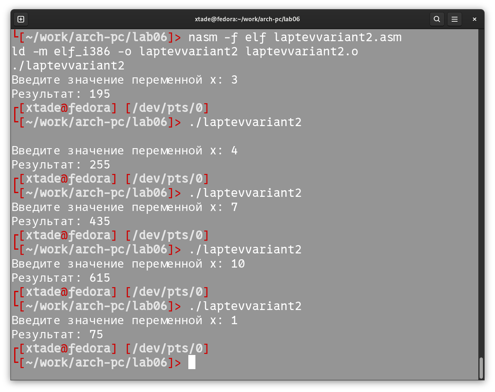{#fig:013 width=70%}

# Выводы

В ходе данной лабораторной работы я освоила арифметические инструкции языка ассемблера NASM.

# Список литературы{.unnumbered}

::: {#refs}
:::
